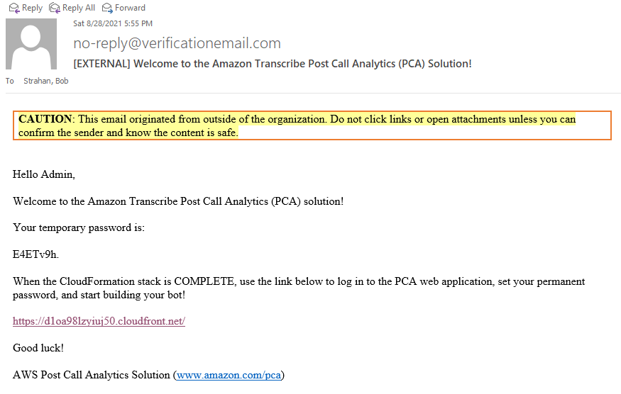

## Amazon Transcribe Post Call Analytics (PCA) Solution

*INTERIM README*

## Build and Publish PCA CloudFormation artifacts

Use the [publish.sh](./publish.sh) bash script to build the project and deploy cloud formation templates to your own deployment bucket. 

Prerequisite: You must already have the [AWS CLI](https://docs.aws.amazon.com/cli/latest/userguide/cli-chap-install.html) installed and configured, or use an AWS Cloud9 environment.

To deploy to non-default region, set environment variable `AWS_DEFAULT_REGION` to a region supported by Amazon Transcribe. See: [AWS Regional Services](https://aws.amazon.com/about-aws/global-infrastructure/regional-product-services/) 
E.g. to deploy in Ireland run `export AWS_DEFAULT_REGION=eu-west-1` before running the publish script.  
**NOTE: Tested only in us-east-1 so far!!**

Run the script with up to 3 parameters:
```
./publish.sh <cfn_bucket> <cfn_prefix> [public]

- <cfn_bucket>: name of S3 bucket to deploy CloudFormation templates and code artifacts. if bucket does not exist it will be created.
- <cfn_prefix>: artifacts will be copied to the path specified by this prefix (path/to/artifacts/)
- public: (optional) Adding the argument "public" will set public-read acl on all published artifacts, for sharing with any account.
```

It downloads package dependencies, builds code zipfiles, replaces local filseystem references in Cfn templates, and copys templates and zipfiles to the cfn_bucket. 
When complete, it displays the URLS for the CloudFormation templates, 1-click URLs for launching the stack create in CloudFormation, and CLI deployment command , e.g.:
```
Outputs
Template URL: https://s3.us-east-1.amazonaws.com/pca-artifacts-bucket/pca/artifacts/pca-main.yaml
CF Launch URL: https://us-east-1.console.aws.amazon.com/cloudformation/home?region=us-east-1#/stacks/create/review?templateURL=https://s3.us-east-1.amazonaws.com/pca-artifacts-bucket/pca/artifacts/pca-main.yaml&stackName=PostCallAnalytics
CLI Deploy: aws cloudformation deploy --template-file /home/ec2-user/environment/aws-transcribe-post-call-analytics/packaged.template --capabilities CAPABILITY_NAMED_IAM CAPABILITY_AUTO_EXPAND --stack-name PostCallAnalytics --parameter-overrides AdminEmail=johndoe@example.com
```


### Deploy

Deploy PCA from the CloudFormation console
- use the 1-click `CF Launch URL` to create a new stack with template  
- use the `Template URL` to create a stack, or to update an existing stack  
OR  
- use the `CLI Deploy` command to create or update an existing stack from the commandline. NOTE - be sure to specify a valid email adress - you'll need it to retrieve the temporary password.

The only parameter that you MUST supply is the **AdminEmail** parameter. All other parameters have defaults.

While the stack is creating, you will receive an email confirming your Admin username, your temporary password, and the URL for the newly installed PCA web application.



Open the web app using the provided URL and log in with your temporary password. *Be careful not to copy/paste trailing white space characters from the email.*
You will be asked to provide a permanent password the first time you log in.


## Security

See [CONTRIBUTING](CONTRIBUTING.md#security-issue-notifications) for more information.

## License

This project is licensed under the Apache-2.0 License.

