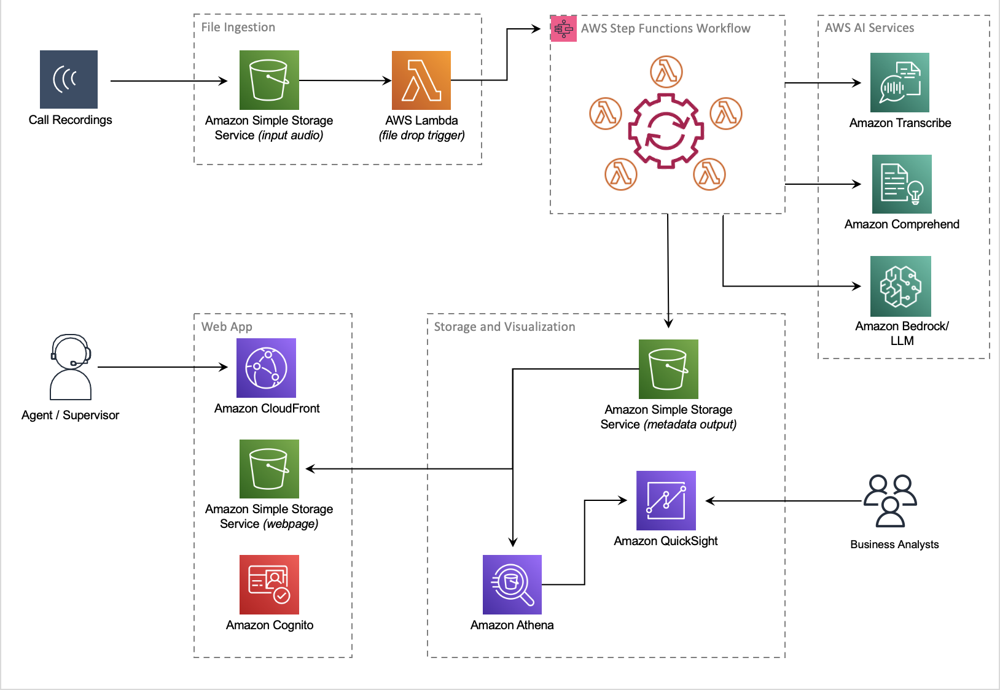

# Amazon Transcribe Post Call Analytics (PCA) Solution

*Companion AWS blog post: [Post call analytics for your contact center with Amazon language AI services](http://www.amazon.com/post-call-analytics)*

## Overview

Your contact center connects your business to your community, enabling customers to order products, callers to request support, clients to make appointments, and much more. Each conversation with a caller is an opportunity to learn more about that caller’s needs, and how well those needs were addressed during the call. You can uncover insights from these conversations that help you manage script compliance and find new opportunities to satisfy your customers, perhaps by expanding your services to address reported gaps, improving the quality of reported problem areas, or by elevating the customer experience delivered by your contact center agents.

This sample solution, Post Call Analytics (PCA), does most of the heavy lifting associated with providing an end-to-end solution that can process call recordings from your existing contact center. PCA provides actionable insights to spot emerging trends, identify agent coaching opportunities, and assess the general sentiment of calls.

If you already have Amazon Transcribe transcripts generated from the Streaming Call Analytics feature then those output transcripts can de delivered to PCA so that they can be aggregated and analyzed in exactly the same way as any audio files that you process from telephony system.  You can use PCA with audio files, with transcript files, or with both. 

*(New!) The latest version (v0.6.0) of our companion Live Call Analytics and Agent Assist (LCA) supports Amazon Transcribe Real-time Call Analytics and provides easy integration with PCA. See [Live Call Analytics and Agent Assist: Companion Solution](#live-call-analytics-and-agent-assist-companion-solution) section below.*

PCA currently supports the following features:

* **Source Input Data**
    * Audio files can be delivered to audio ingestion location in Amazon S3, which is defined in AWS Systems Manager Parameter store in the bucket defined in `InputBucketName` and folder `InputBucketRawAudio`. 
    * Transcript files from Transcribe's Streaming Analytics APIs can be delivered to the transcript ingest location in Amazon S3, which is defined in AWS Systems Manager Parameter store in the bucket defined in `InputBucketName` and folder `InputBucketOrigTranscripts`
    

* **Transcription** *(audio files only)*
    * Batch turn-by-turn transcription with support for [Amazon Transcribe custom vocabulary](https://docs.aws.amazon.com/transcribe/latest/dg/custom-vocabulary.html) for accuracy of domain-specific terminology 
    * [Personally identifiable information (PII) redaction](https://docs.aws.amazon.com/transcribe/latest/dg/call-analytics-pii-redaction.html) from transcripts and audio files, and [vocabulary filtering](https://docs.aws.amazon.com/transcribe/latest/dg/create-filter.html) for masking custom words and phrases
    * Multiple languages and automatic language detection
    * Standard audio file formats
    * Caller and agent speaker labels using [channel identification](https://docs.aws.amazon.com/transcribe/latest/dg/channel-id.html) or [speaker diarization](https://docs.aws.amazon.com/transcribe/latest/dg/diarization.html)
* **Analytics** *(audio files only)*
    * Caller and agent sentiment details and trends
    * Talk and non-talk time for both caller and agent 
    * Configurable Transcribe Call Analytics categories based on the presence or absence of keywords or phrases, sentiment, and non-talk time
    * Detects callers’ main issues using built-in ML models in Transcribe Call Analytics
    * Discovers entities referenced in the call using Amazon Comprehend standard or custom entity detection models, or simple configurable string matching 
    * Detects when caller and agent interrupt each other
    * Speaker loudness
* **Search**
    * Search on call attributes such as time range, sentiment, or entities
    * Search transcriptions
* **Analytics Pipeline and Dashboards on Amazon QuickSight**
    * Optionally deploy [Advanced reporting and analytics for the Post Call Analytics (PCA) solution with Amazon QuickSight](https://aws.amazon.com/blogs/big-data/advance-reporting-and-analytics-for-the-post-call-analytics-pca-solution-with-amazon-quicksight/) 
* **Other**
    * Detects metadata from audio file names, such as call GUID, agent’s name, and call date time
    * Can ingest telephony contact trace record files (CTRs) for stereo to mark transcript speech segments as being from an **IVR** system, as well as identify multiple Agents in a single call
    * Scales automatically to handle variable call volumes
    * Bulk loads large archives of older recordings while maintaining capacity to process new recordings as they arrive
    * Sample recordings so you can quickly try out PCA for yourself
    * It’s easy to install with a single [AWS CloudFormation](https://aws.amazon.com/cloudformation/) template


## Architecture



Call recording audio files are uploaded to the S3 bucket and folder, identified in the main stack outputs as `InputBucket` and `InputBucketPrefix`, respectively. The sample call recordings are automatically uploaded because you set the parameter `loadSampleAudioFiles` to `true` when you deployed PCA. 

As each recording file is added to the input bucket, an S3 event notification triggers a Lambda function that initiates a workflow in Step Functions to process the file. The workflow orchestrates the steps to start an Amazon Transcribe batch job and process the results by doing entity detection and additional preparation of the call analytics results. Processed results are stored as JSON files in another S3 bucket and folder, identified in the main stack outputs as ``OutputBucket`` and ``OutputBucketPrefix``**.**

If you deliver transcript files rather than audio files then the majority of the above is bypassed, and the transcripts just undergo the same post-Transcribe results procesing, giving you a single store of call analytics data for your call data from multiple sources.

As the Step Functions workflow creates each JSON results file in the output bucket, an S3 event notification triggers a Lambda function, which loads selected call metadata into a DynamoDB table.

The PCA UI web app queries the DynamoDB table to retrieve the list of processed calls to display on the home page. The call detail page reads additional detailed transcription and analytics from the JSON results file for the selected call.

Amazon S3 lifecycle policies delete recordings and JSON files from both input and output buckets after a configurable retention period, defined by the deployment parameter `RetentionDays`. S3 event notifications and Lambda functions keep the DynamoDB table synchronized as files are both created and deleted.

When the `EnableTranscriptKendraSearch` parameter is `true`, the Step Functions workflow also adds time markers and metadata attributes to the transcription, which are loaded into an Amazon Kendra index. The transcription search web application is used to search call transcriptions. For more information on how this works, see [Make your audio and video files searchable using Amazon Transcribe and Amazon Kendra](http://www.amazon.com/mediasearch).

## Integration with Telephony CTR Files

Currently, the list of telephony systems where PCA can ingest CTR files are:

- Genesys

The CTR files, which are typically named in a way that easily relates it to the audio file being ingested, needs to delivered to PCA alongside the audio file; e.g. they are delivered together to the same Amazon S3 bucket.  One file is the standard conversational metadata file that contains information around the call sessions, participants and queues, and the second is a call-specific metadata file that has some specific information around the position of this particular call's place in a wider conversation.

Once standard PCA processing is complete the telephony-specific CTR handler will be invoked.  This will update the PCA results with the following:

- Tagging of any IVR entry in the Agent's transcript as being from an IVR
- Removing the sentiment scores and entities associated with IVR lines
- Identification of multiple Agents within the call, associating the telephony system's internal user identifier with their parts of the transcript and correctly allocating each agent's actual speaking time
- Additional telephony-specific data, such as the Genesys queues involved in the call, is made available


## Deployment instructions

## (optional) Build and Publish PCA CloudFormation artifacts
_Note: Perform this step only if you want to create deployment artifacts in your own account. Otherwise, we have hosted a CloudFormation template for 1-click deployment in the [deploy](#deploy) section_.

Use the [publish.sh](./publish.sh) bash script to build the project and deploy cloud formation templates to your own deployment bucket. 

Prerequisite: You must already have the [AWS CLI](https://docs.aws.amazon.com/cli/latest/userguide/cli-chap-install.html) installed and configured, or use an AWS Cloud9 environment.

To deploy to non-default region, set environment variable `AWS_DEFAULT_REGION` to a region supported by Amazon Transcribe. See: [AWS Regional Services](https://aws.amazon.com/about-aws/global-infrastructure/regional-product-services/) 
E.g. to deploy in Ireland run `export AWS_DEFAULT_REGION=eu-west-1` before running the publish script.  

**NOTE:** To publish in a region that is not yet supported by Amazon Kendra, follow the direction below, but use the script `publish-nokendra.sh` instead of `publish.sh`. See [AWS Region Table](https://aws.amazon.com/about-aws/global-infrastructure/regional-product-services/)

Run the script with up to 3 parameters:
```
./publish.sh <cfn_bucket> <cfn_prefix> [public]

- <cfn_bucket>: name of S3 bucket to deploy CloudFormation templates and code artifacts. if bucket does not exist it will be created.
- <cfn_prefix>: artifacts will be copied to the path specified by this prefix (path/to/artifacts/)
- public: (optional) Adding the argument "public" will set public-read acl on all published artifacts, for sharing with any account.
```

It downloads package dependencies, builds code zipfiles, replaces local filseystem references in Cfn templates, and copys templates and zipfiles to the cfn_bucket. 
When complete, it displays the URLS for the CloudFormation templates, 1-click URLs for launching the stack create in CloudFormation, and CLI deployment command , e.g.:
```
Outputs
Template URL: https://s3.us-east-1.amazonaws.com/<bucket>/pca/artifacts/pca-main.yaml
CF Launch URL: https://us-east-1.console.aws.amazon.com/cloudformation/home?region=us-east-1#/stacks/create/review?templateURL=https://s3.us-east-1.amazonaws.com/<bucket>/pca/artifacts/pca-main.yaml&stackName=PostCallAnalytics
CLI Deploy: aws cloudformation deploy --template-file /home/ec2-user/environment/aws-transcribe-post-call-analytics/build/packaged.template --capabilities CAPABILITY_NAMED_IAM CAPABILITY_AUTO_EXPAND --stack-name PostCallAnalytics --parameter-overrides AdminEmail=johndoe@example.com
```


## Deploy the CloudFormation stack

Start your PCA experience by using AWS CloudFormation to deploy the solution with sample recordings loaded.

To get PCA up and running in your own AWS account, follow these steps (if you do not have an AWS account, please see [How do I create and activate a new Amazon Web Services account?](https://aws.amazon.com/premiumsupport/knowledge-center/create-and-activate-aws-account/)):

1. Log into the [AWS console](https://console.aws.amazon.com/) if you are not already.  
*Note: If you are logged in as an IAM user, ensure your account has permissions to create and manage the necessary resources and components for this application.* 
2. Use the  **Launch Stack** button to deploy the PCA solution in the us-east-1 (N. Virginia) AWS Region:

Region name | Region code | Launch
--- | --- | ---
US East (N. Virginia) | us-east-1 | [](https://us-east-1.console.aws.amazon.com/cloudformation/home?region=us-east-1#/stacks/create/review?templateURL=https://s3.us-east-1.amazonaws.com/aws-ml-blog-us-east-1/artifacts/pca/pca-main.yaml&stackName=PCA)
EU Central (Frankfurt) | eu-central-1 | [](https://eu-central-1.console.aws.amazon.com/cloudformation/home?region=eu-central-1#/stacks/create/review?templateURL=https://s3.eu-central-1.amazonaws.com/aws-ml-blog-eu-central-1/artifacts/pca/pca-main.yaml&stackName=PCA)

OR, if you opted to follow the steps above to Build and Publish PCA CloudFormation artifacts, use your own published CloudFormation template instead.

* For **Stack name**, use the default value, ``PostCallAnalytics``. 
* For **AdminUsername,** use the default value, `admin`.
* For **AdminEmail,** use a valid email address—your temporary password is emailed to this address during the deployment.
* For **loadSampleAudioFiles**, change the value to `true`.
* For **EnableTranscriptKendraSearch**, change the value to ``Yes, create new Kendra Index (Developer Edition)``.


If you have previously used your [Amazon Kendra](https://aws.amazon.com/kendra/) Free Tier allowance, you incur an hourly cost for this index (more information on cost later in this post). Amazon Kendra transcript search is an optional feature, so if you don’t need it and are concerned about cost, use the default value of ``No``.

* For **EnablePcaDashboards**, change the value to ``yes`` to install the optional analytics pipeline and Amazon QuickSight analysis and dashboards. 
    * BEFORE INSTALLING: You **must** enable Amazon Quicksight in your account:
        1. Navigate to the QuickSight service from the console.
        2. Choose Sign up for QuickSight.
        3. Select the edition.
        4. Enter your account name and notification email address.

* For all other parameters, use the default values. 


If you want to customize the settings later, for example to apply custom vocabulary to improve accuracy, or to customize entity detection, you can update the stack to set these parameters.


* Select the two acknowledgement boxes, and choose **Create stack**.


The main CloudFormation stack uses nested stacks to create the following resources in your AWS account:


* [Amazon Simple Storage Service](https://aws.amazon.com/s3) (Amazon S3) buckets to hold build artifacts and call recordings
* [Amazon Systems Manager Parameter Store](https://docs.aws.amazon.com/systems-manager/latest/userguide/systems-manager-parameter-store.html) settings to store configuration settings 
* [AWS Step Functions](https://aws.amazon.com/step-functions) workflows to orchestrate recording file processing
* [AWS Lambda](https://aws.amazon.com/lambda/) functions to process audio files and turn-by-turn transcriptions and analytics
* [Amazon DynamoDB](https://aws.amazon.com/dynamodb/) tables to store call metadata
* Website components including S3 bucket, [Amazon CloudFront](https://aws.amazon.com/cloudfront/) distribution, and [Amazon Cognito](https://aws.amazon.com/cognito) user pool
* Other miscellaneous supporting resources, including [AWS Identity and Access Management](https://aws.amazon.com/iam/) (IAM) roles and policies (using least-privilege best practices), [Amazon Simple Queue Service](https://aws.amazon.com/sqs/) (Amazon SQS) message queues, and [Amazon CloudWatch](https://aws.amazon.com/cloudwatch) log groups.
* Optionally, an Amazon Kendra index and [AWS Amplify](https://aws.amazon.com/amplify/) search application to provide intelligent call transcript search.


The stacks take about 20 minutes to deploy. The main stack status shows as `CREATE_COMPLETE` when everything is deployed. 


### Set your password 

After you deploy the stack, you need to open the PCA web user interface and set your password.


* On the AWS CloudFormation console, choose the main stack, `PostCallAnalytics`, and choose the **Outputs** tab.

* Open your web browser to the URL shown as `WebAppURL` in the outputs. 

You’re redirected to a login page.

* Open the email your received, at the email address you provided, with the subject “Welcome to the Amazon Transcribe Post Call Analytics (PCA) Solution!” 

This email contains a generated temporary password that you can use to log in (as user ``admin``) and create your own password. 

* Set a new password.

Your new password must have a length of at least 8 characters, and contain uppercase and lowercase characters, plus numbers and special characters.

You’re now logged in to PCA. Because you set `loadSampleAudioFiles` to `true`, your PCA deployment now has three sample calls pre-loaded for you to explore.


### Optional: Open the transcription search web UI and set your permanent password 

Follow these additional steps to log in to the companion transcript search web app, which is deployed only when you set `EnableTranscriptKendraSearch` when you launch the stack.


* On the AWS CloudFormation console, choose the main stack, `PostCallAnalytics`, and choose the **Outputs** tab.
* Open your web browser to the URL shown as `TranscriptionMediaSearchFinderURL` in the outputs.


You’re redirected to the login page.

 

* Open the email your received, at the email address you provided, with the subject “Welcome to Finder Web App.” 


This email contains a generated temporary password that you can use to log in (as user ``admin``).


* Create your own password, just like you already did for the PCA web application. 


As before, your new password must have a length of at least 8 characters, and contain uppercase and lowercase characters, plus numbers and special characters.

You’re now logged in to the transcript search Finder application. The sample audio files are indexed already, and ready for search.
  

### Optional: Post deployment steps to enable Amazon QuickSight dashboards

Follow these additional steps to enable Amazon QuickSight dashboards, deployed only when you set `EnablePcaDashboards` when you launch the stack.

1. In the QuickSight console, choose the user icon (top right) to open the menu, and choose Manage QuickSight.
2. On the admin page, choose "Security and Permissions", than add access to the Amazon S3 **OutputBucket** referenced in the deployed stack Outputs tab. 
3. On the admin page, choose Manage assets, then choose Dashboards.
   * Select <Stack Name>-PCA-Dashboard and choose Share. Enter the QuickSight user or group and choose Share again.
   * Optionally, to customize the dashboard further, share <Stack Name>-PCA-Analysis under Asset type analyses and <Stack Name>-PCA-* under Datasets. Enter the QuickSight user or group and choose Share again.

For additional information about the PCA advanced analytics and dashboards solution, see the companion blog post: http://www.amazon.com/pca-dashboards.
   
   
### Update an existing stack

1. Log into the [AWS console](https://console.aws.amazon.com/) if you are not already.
*Note: If you are logged in as an IAM user, ensure your account has permissions to create and manage the necessary resources and components for this application.*
2. Select your existing PostCallAnaytics stack
3. Choose **Update**
4. Choose **Replace current template**
5. Use one of the **published template** below for your region, or use the **Template URL** output of the publish.sh script if you have build your own artifacts from the repository:

Region name | Region code | Template URL
--- | --- | ---
US East (N. Virginia) | us-east-1 | https://s3.us-east-1.amazonaws.com/aws-ml-blog-us-east-1/artifacts/pca/pca-main.yaml
EU Central (Frankfurt) | eu-central-1 | https://s3.eu-central-1.amazonaws.com/aws-ml-blog-eu-central-1/artifacts/pca/pca-main.yaml

6. Choose **Next** and review the stack parameters. 
7. Chose **Next** two more times.
8. Check the blue boxes for creating IAM resources, and choose **Update stack** to start the update.


## Live Call Analytics and Agent Assist: Companion solution

Our companion solution, Live Call Analytics and Agent Assist (LCA), offers real-time transcription and analytics capabilities by using the Amazon Transcribe real-time APIs. Unlike PCA, which transcribes and analyzes recorded audio after the call has ended, LCA transcribes and analyzes your calls as they are happening and provides real-time updates to supervisors and agents.  The new Amazon Transcribe Real-time Call Analytics service provides post-call analytics output from your streaming sessions just a few minutes after the call has ended. LCA (v 0.6.0 or later) can now send this post-call analytics data to PCA to provide analytics visualizations for completed calls without needing to transcribe the audio a second time. Configure LCA (v0.6.0 or later) to integrate with PCA (v0.4.0 or later) and use the two solutions together to get the best of both worlds.. See [Live call analytics and agent assist for your contact center with Amazon language AI services](https://www.amazon.com/live-call-analytics) for more information.

## Learn more

Check out the AWS blog post: [Post call analytics for your contact center with Amazon language AI services](https://www.amazon.com/post-call-analytics)

PCA documentation and tutorials are available here: [Post Call Analytics](https://catalog.us-east-1.prod.workshops.aws/v2/workshops/2031cf73-22de-40c4-899a-5e4abd940e9a/en-US) 

Also check out the companion sample solution - [Live call analytics for your contact center with Amazon language AI services](https://www.amazon.com/live-call-analytics). Live Call Analytics (LCA), offers real time-transcription and analytics capabilities by using the Amazon Transcribe and Amazon Comprehend real-time APIs. Unlike PCA, which transcribes and analyzes recorded audio after the call has ended, LCA transcribes and analyzes your calls as they are happening and provides real-time updates to supervisors and agents. You can configure LCA to store call recordings to the PCA’s ingestion S3 bucket, and use the two solutions together to get the best of both worlds. See Live call analytics for your contact center with Amazon language AI services for more information.


## Security

See [CONTRIBUTING](CONTRIBUTING.md#security-issue-notifications) for more information.

## License

This project is licensed under the Apache-2.0 License.

