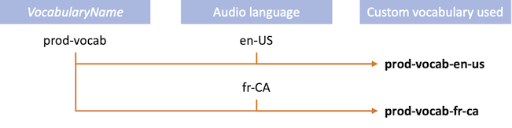
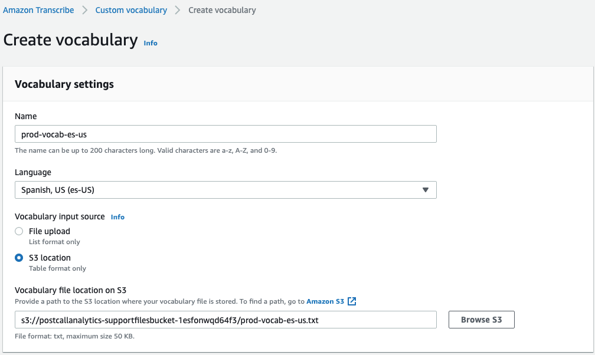

#### Custom vocabulary

The [Custom Vocabulary](https://docs.aws.amazon.com/transcribe/latest/dg/custom-vocabulary.html)  feature of Amazon Transcribe allows customers to make the service pay particular attention to domain-specific words that they need to be correctly transcribed - typically this is brand names, internal project names, or common colloquial terms.

**Custom vocabulary file format**

The file format for this is a TAB-separated text file. This contains a single header line and four columns - it must be stressed that even if a column value for a particular row is blank then you must still tab to it, and you must not use space characters to line things up visually. An example few lines are shown below, but note that the columns are allowed to appear in any order in your file.

| Phrase | DisplayAs | SoundsLike | IPA |
| --- | --- | --- | --- |
| Los-Angeles | Los Angeles |  | ɛ f b i aɪ |
| F.B.I. | FBI |  |  |
| Etienne |  | eh-tee-en |  |

Only data in the **Phrase** column is mandatory, but the other columns must be present with at least a blank data entry. You can have data in one of either **SoundsLike** or **IPA** (but not both), and **DisplayAs** is used if you want the transcribed text displayed in a way different from **Phrase**. There are many rules that you have to adhere to:

-   Any space character in a multi-word **Phrase** must be replaced by a `-`
-   Any pronounced letters in a **Phrase**, such as in acronyms like F.B.I., must have a `.` after each letter
-   Plurals of an acronym **Phrase** must separate out the `'s` from the acronym with a `-` (such as `FBIs` => `F.B.I.-s)`
-   A **Phrase** that consists of a word and acronym must separate those sections with a `-` (such as `DynamoDB` => `Dynamo-D.B.)`
-   Each sound hint in a **SoundsLike** field must be separated by a `-`
-   **IPA** characters, or valid IPA character pairs, must be separated by a space
-   There should be no leading or trailing spaces in any column

This guide cannot teach someone how to build phonetic representations - the Amazon Transcribe documentation contains all necessary technical details. For further assistance and guidance on building your own vocabulary files, please contact your AWS account team.

##### Custom vocabulary application configuration

The application lets you configure a base name for your vocabularies in the configuration setting `VocabularyName`. This becomes the base name for all vocabulary files defined in Amazon Transcribe that will be used by the application, allowing you to define multiple language variants of the same vocabulary. For instance, if you configure the base name as **prod-vocab** then the application will try and use a Transcribe Custom Vocabulary as follows:

Hence, whenever a file is processed, then the application will attempt to use vocabulary based upon the configured base name and the specified or identified language code, with the language code always appearing in lower-case. This means that for one installation you only have to make a single configuration setting for the vocabulary, such as `prod-vocab`, and the application will use the appropriate language-specific variant, such as `prod-vocab-es-us`.

If the custom vocabulary language variant does not exist, such as **prod-vocab-es-us** not being defined, then audio files files ingested in the language `es-US` will be processed without any custom vocabulary - this will be indicated in the _Call Details_ screen for that call, as the **Custom Vocabulary** field will show `-` rather than the name of the vocabulary used.

##### Creating a custom vocabulary in Amazon Transcribe

The vocabulary file, with the relevant language suffix, needs to be uploaded to an S3 bucket. There is no restriction on this bucket, but it is recommended that you use the bucket defined in the `SupportFilesBucketName` configuration setting, which is used for other ancillary files such as entity files for entity recognition. Whilst it isn't mandatory, we also recommend that you name the files such that they match the vocabulary base name and the target language, so for the Spanish file in the above example we would recommend that the file is called **prod-vocab-es-us.txt** - you may end up have multiple language variant files in this bucket, so following this convention will make them easier to manage.

Creation of multiple custom vocabulary files

You will need to repeat this process once per language where you need Custom Vocabulary support

Once uploaded then you need to navigate to the Amazon Transcribe section of the AWS Console and, on the left-hand menu, select _Custom vocabulary_. Hit the **Create vocabulary** button and you will be presented with this screen:

Enter the parameters as follows:

-   **Name** - the name of the vocabularly variant, matching the language naming convention
-   **Language** - the language that this vocabulary variant will support
-   **Vocabulary input source** - select _S3 Location_ as the input source, as table-formatted vocabulary files can only be imported from an S3 source locations
-   **Vocabulary file location on S3** - use the _Browse S3_ button to file your uploaded file

Amazon Transcribe will then begin the vocabulary generation process once you press the _Create vocabulary_ button, and it can take take several minutes to process. If there are any errors in the file, most likely in the IPA sections, then the process will terminate quickly with an error that should tell you roughly what the problem is with your file.

For further assistance with any errors, please contact AWS Support.