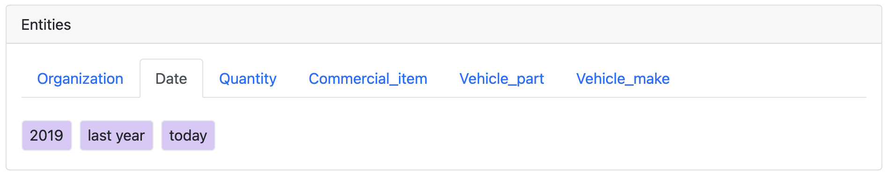
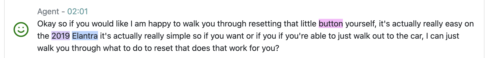

#### Standard entity detection

Amazon Comprehend provides a [pre-built API](https://docs.aws.amazon.com/comprehend/latest/dg/how-entities.html)  to detect number of known entities within a block of text.

| Type | Description |
| --- | --- |
| COMMERCIAL\_ITEM | A branded product |
| DATE | A full date (for example, 11/25/2017), day (Tuesday), month (May), or time (8:30 a.m.) |
| EVENT | An event, such as a festival, concert, election, etc. |
| LOCATION | A specific location, such as a country, city, lake, building, etc |
| ORGANIZATION | Large organizations, such as a government, company, religion, sports team, etc. |
| OTHER | Entities that don't fit into any of the other entity categories |
| PERSON | Individuals, groups of people, nicknames, fictional characters |
| QUANTITY | A quantified amount, such as currency, percentages, numbers, bytes, etc. |
| TITLE | An official name given to any creation or creative work, such as movies, books, songs, etc. |

The application will send each segment of text from each speaker to Amazon Comprehend to detect any of these entities, and then embed tags for any detected entity within the output transcript of the call. By default, all of these entities are detected, but you are able to remove individual types from the detection process. This is done by changing the value for the `EntityTypes` configuration parameter, using the values shown in the [Configuration](../deployment/configuration.md#comprehend) section. For instance, if you are only interested in organization names, locations and dates the you would set his paramater to `ORGANIZATION | LOCATION | DATE`, noting the spaces between each term and the `|` character.

#### Custom entity detection options

There are two custom entity detection methods available to the application:

1.  Context-sensitive identification of entities using an Amazon Comprehend [Custom Entity Recognition model](https://docs.aws.amazon.com/comprehend/latest/dg/custom-entity-recognition.html) 
2.  String search technique using entity names and types defined in a CSV file

Custom Entity detection via Amazon Comprehend requires a large amount of training data, and initially customers will not have this available. Essentially, it needs a list of customer entities and example sentences where those entities have been seen in context. This data takes time to acquire and annotate, so this application allows you to define just the entity list, and then it will use string-search techniques to identify them in the call transcripts. This will not find the entities in context, rather it will see them wherever they occur, but this means that once a customer has generated a large amount of call transcript data then they could then use that data to train a custom entity mode.

The following configuration settings apply to entity detection:

-   `EntityRecognizerEndpoint` - the Comprehend Custom Entity Recognizer model endpoint
-   `EntityStringMap` - base name of a CSV file containing the customer entity values
-   `EntityThreshold` - confidence threshold for accepting a Comprehen custom entity

If a _EntityRecognizerEndpoint_ is defined and is available for the call language then it is used, and the _EntityThreshold_ value is used to decide whether or not to inject the entity data into the call. If the model does not exist for that language then the _EntityStringMap_ file is loaded instead. The application requires no further configuration, and will use the relevant method at all times.

Both the endpoint name and the CSV filename are basenames, very similar to the custom vocabulary naming method. You declare in the configuration a basename, and then the application will append the language code to it and look for that file - again, this lets you define a single name that is applicable to multiple endpoints or files. For example, an English call would make the following interpretation:

-   `EntityRecognizerEndpoint` = **prod-entities** => use endpoint **prod-entities-en**
-   `EntityStringMap` = **prod-entities.csv** => use CSV file **prod-entities-en.csv**

Note that unlike Amazon Transcribe, Amazon Comprehend just uses the language code and ignores the regional variant, so **fr-FR** and **fr-CA** audio files would both map to a **\-fr** addition to the basenames.

##### Amazon Comprehend custom entity detection

All information required to create a Custom Entity Detection model is in the [AWS documentation](https://docs.aws.amazon.com/comprehend/latest/dg/custom-entity-recognition.html)  for building and deploying a custom endpoint. Other than the endpoint naming convention mentioned previously everything else is as per the documentation.

For the sake of consistency, we recommend that you upload the files required to create a Custom Entity Model to the S3 bucket defined by the `SupportFilesBucketName` configuration parameter. If you need further assistance in creating a custom model then please contact AWS for assistance.

##### Simple entity string search

There is no additional configuration required to use the simple file-based entity search mechanism - if there is no Amazon Comprehend Custom Entity endpoint available for the current language, but a CSV file can be found for the configured basename, then the feature is automatically enabled.

The format of the CSV file, which exactly matches that for the Custom Entities source file, is as follows:

| **Text** | **Type** |
| --- | --- |
| Amazon | CORPORATE |
| Kindle | BRAND |
| Fire TV | BRAND |
| Prime Video | SERVICE |

You define your entity types - there is no limit to the number of types that you can create, be we recommend no more than 25 types, as that currently is the limit of entity types on Amazon Comprehend's Custom Entity Detection; if you use more than that limit here then you will not be able to migrate the file to the custom model in the future.

In order to use it the file must be uploaded to the S3 bucket defined in the `SupportFilesBucketName` configuration setting. Once there the application will load it in as and when necessary when it is processing the output from Amazon Transcribe.

#### Detected entities

Regardless of the method of entity detection being performed, the results are always shown in the same way. First, high up on the call details screen, there is a tabbed control bar as follows:

Each of the tabs represents the type of the detected entity, and by clicking on a tab you will see the names of the unique entity values for that type that have been found in the audio transcript - these types could be from any of the entity detection sources discussed above.

As you click through the various type tabs you will see that the entity values are highlighted in a different colour per entity type. Within the transcript itself, any text that triggered the identification of an entity is highlighted in the colour approriate to the entity type, as shown below.

In this example we are showing 3 different entity types, which were all present in the entity header image example shown previously.

-   **button** - _Vehicle\_part_
-   **2019** - _Date_
-   **Elantra** - _Commercial\_Item_