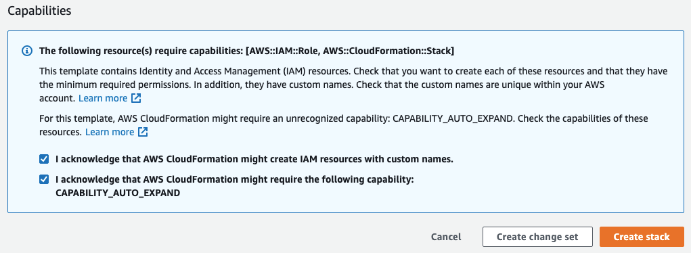
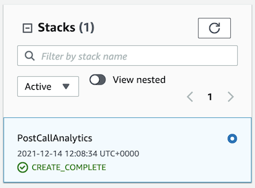
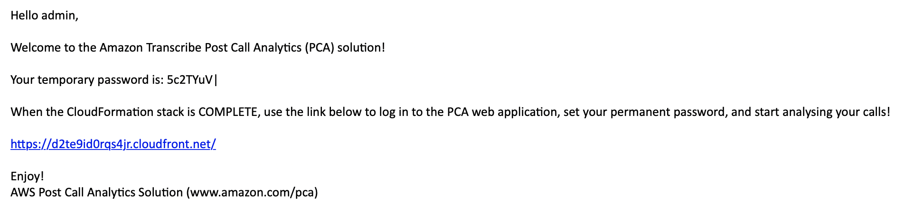
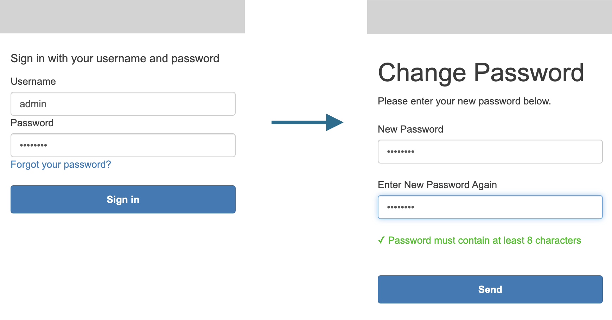
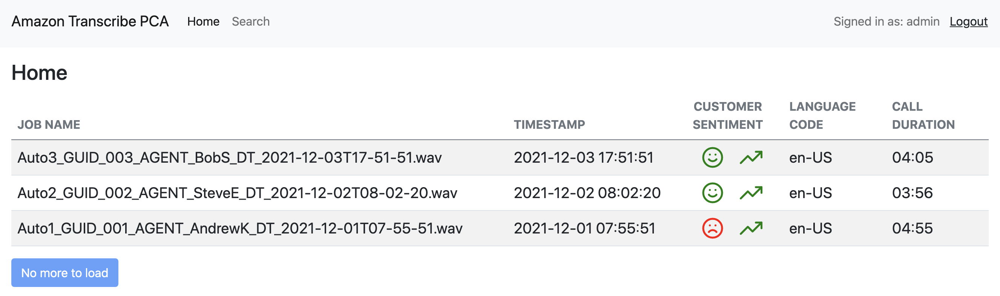

#### Installation via AWS CloudFormation 

##### Launch the installation script 

Start your PCA experience by using AWS CloudFormation to deploy the solution with sample recordings loaded. The source code is available in our [GitHub repository](https://github.com/aws-samples/amazon-transcribe-post-call-analytics) , so please follow the directions in the [README](https://github.com/aws-samples/amazon-transcribe-post-call-analytics/blob/main/README.md)  file if you wish to deploy the solution to additional regions supported by Amazon Transcribe. A quick shortcut to deploy this in the Northern Virgina region `us-east-1` is shown below:

[Deploy application to North Virginia](https://us-east-1.console.aws.amazon.com/cloudformation/home?region=us-east-1#/stacks/create/review?templateURL=https://s3.us-east-1.amazonaws.com/aws-ml-blog-us-east-1/artifacts/pca/pca-main.yaml&stackName=PostCallAnalytics) 

This will bring up the standard AWS CloudFormation screen - it will initially prompt you for a name for the application stack, and it is recommended that you name it `PostCallAnalytics`. You can then proceed to set the installation parameters required for an initial deployment.

For information on the costs for running this application, please see the [Running Costs](https://studio.us-east-1.prod.workshops.aws/preview/2031cf73-22de-40c4-899a-5e4abd940e9a/builds/36aedf9e-2590-4fca-9a96-7902ed26ca07/en-US/deployment/installation#running-costs) section at the bottom of this page.
 
##### Installation parameters 

The majority of the parameters can be left at their default settings, but for your first installation of the application you should set the following parameters - these are the first parameters shown in the AWS CloudFormation configuration screen.

| Parameter | Description | Value |
| --- | --- | --- |
| **AdminUsername** | Admininstration user for the Web User Interface | admin |
| **AdminEmail** | Email address where the _admin_ user temporary password is mailed to | _\[your email address\]_ |
| **loadSampleAudioFiles** | Process the demonstration audio files as part of the installation process | true |
| **EnableTranscriptKendraSearch** | Push all call transcripts to Amazon Kendra to allow natural language searching | Yes, create new Kendra index (Developer Edition) |

The first two **AdminXXX** parameters are mandatory, and must be set in order to allow the installation to proceed. The other parameters have default values that turn off both both features, but it is recommended that you enable both of these initially whilst you learn and get used to the capabilities of the application.

Amazon Kendra

If you have previously used your Amazon Kendra free tier allowance then you will incur an hourly cost for this index. Amazon Kendra search is an optional feature, so if you do not need it or are concerned by the costs then leave this parameter at its default value of `No`
 
##### Final installation steps

Now scroll to the bottom of the screen past the other parameters, where you will see a confirmation dialog entitled **Capabilities** - you need select both acknowledgement boxes and then press the **Create stack** button.

The CloudFormation template consists of a series of nested stacks, which will create the following resources in around 15-20 minutes. The following resources are created as part of the deployment.

-   [Amazon Simple Storage Service](https://aws.amazon.com/s3)  (Amazon S3) buckets to hold build artifacts and call recordings
-   [Amazon Systems Manager Parameter Store](https://docs.aws.amazon.com/systems-manager/latest/userguide/systems-manager-parameter-store.html)  settings to store configuration settings
-   [AWS Step Functions](https://aws.amazon.com/step-functions)  workflows to orchestrate recording file processing
-   [AWS Lambda](https://aws.amazon.com/lambda/)  functions to process audio files and turn-by-turn transcriptions and analytics
-   [Amazon DynamoDB](https://aws.amazon.com/dynamodb/)  tables to store call metadata
-   Website components including S3 bucket, [Amazon CloudFront](https://aws.amazon.com/cloudfront/)  distribution, and [Amazon Cognito](https://aws.amazon.com/cognito)  user pool
-   Other miscellaneous supporting resources, including [AWS Identity and Access Management](https://aws.amazon.com/iam/)  (IAM) roles and policies (using least-privilege best practices), [Amazon Simple Queue Service](https://aws.amazon.com/sqs/)  (Amazon SQS) message queues, and [Amazon CloudWatch](https://aws.amazon.com/cloudwatch)  log groups.
-   Optionally, an Amazon Kendra index and [AWS Amplify](https://aws.amazon.com/amplify/)  search application to provide intelligent call transcript search.

During the installation process the email address that you entered for **AdminEmail** will receive an email with the subject line _"Welcome to the Amazon Transcribe Post Call Analytics (PCA) Solution!"_, which holds the application login URL and your temporary login credentials - please do not try to login until the deployment has completed. Once the application has fully deployed you will see that the stack that you named `PostCallAnalytics` will be showing as complete in the CloudFormation console, as per below.

##### Logging in to the application for the first time

The Web User Interface for the application is at a URL behind Amazon CloudFront. In the email that has been sent to the admin email address you will find the URL for the application, along with a temporary password. The body of the email should look similar to the following:

Clicking on the URL will open the application's UI in your preferred browser, bringing up the login page for the applicatin - it is recommended that you bookmark this page for later re-use. Enter your administration username and the password password given in the email, and you'll then be asked to change your password - note, your new password must contain at least 8 characters.

You are now logged into the application, and as you set the initial configuration parameter **loadSampleAudioFiles** to `true` you should be able to see the following three processed calls.

#### Running Costs

The application is entirely serverless, so the costs that you incur will be based upon:

-   the number and duration of the calls being processed
-   the storage costs associated with the audio files and the results files
-   the options within Amazon Transcribe and Amazon Comprehend that you choose to use

##### Costings per 100 minutes of call audio 

Costings are shown below for when you use either the Analytics or Standard API modes of Amazon Transcribe, and where you enable PII Redaction and utilise Language Identification. It is based upon 20 x 5 minutes calls, which is 100 minutes of processed audio, and is assuming the `us-east-1` AWS Region.

| API MODE | Base Transcription | PII Redaction | Language Identification | Sentiment Analysis | Standard Entities | Amazon S3 Storage | TOTAL |
| --- | --- | --- | --- | --- | --- | --- | --- |
| Analytics | $3.00 | $0.24 | $0.024 | _(n/a)_ | $0.10 | $0.05 / month | $3.42 |
| Standard | $2.40 | $0.24 | $0.024 | $0.05 | $0.10 | $0.05 / month | $2.87 |

There are additional minor charges for services such as AWS Lambda and AWS Step Functions, and for data transfer charges, but these would make up less than 1% of the total charges above.

Please note the Amazon S3 pricing model

Charges are per GB of storage per month, so once an audio file is uploaded and processed there will be an ongoing charge for storing audio files and the associated text output files.

##### Costings for Amazon Comprehend Custom Entity Model 

The solution fully supports an Amazon Comprehend Custom Entity model that has been trained and deployed to an endpoint by a customer. The standard deployment of this application does not setup such a custom model endpoint, so you will not incur any such costs by following the instructions in the guide. Full costings of building and deploying such a model are given in the [Amazon Comprehend Pricing](https://aws.amazon.com/comprehend/pricing/)  page.

Please note the following excerpt from the Amazon Comprehend pricing page

_"Charges will continue to incur from the time you start the endpoint until it is deleted even if no documents are analyzed"_

##### Charges after uninstallation

After the application is uninstalled there may still be charges remaining for the following two aspects:

-   Data storage in Amazon S3
-   Amazon Comprehend Custom Entity model endpoints

Please ensure that you delete the data that you no longer require, and disable the Amazon Comprehend endpoint if it is not required by any of your other internal applications.