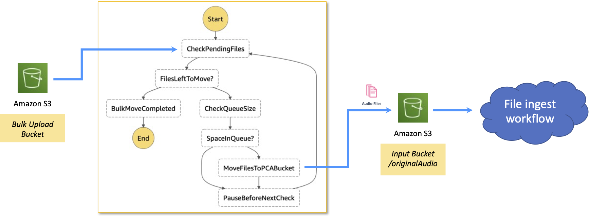
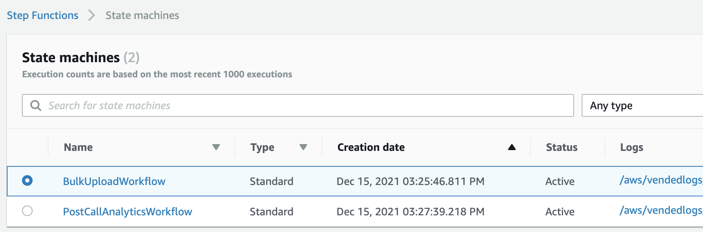
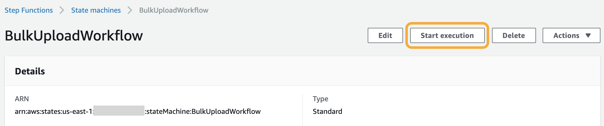

#### Bulk file ingestion workflow 

The bulk import workflow is designed to allow you to ingest a large number of files as quickly as possible, whilst still retaining enough capacity in your AWS account to process files that are being ingested via the standard [File drop](./file-drop.md) workflow. This process will read files from the `BulkUploadBucketName` bucket and move them into the right folder inside the `InputBucketName` bucket - the workflow itself is shown in the following diagram.

The reasons for this drip-feed approach are as follows:

-   Each AWS account has a default limit of 250 concurrent Amazon Transcribe standard jobs or 100 Call Analytics jobs
-   Amazon Transcribe can automatically queue a number of jobs if the maximum number of jobs are currently being executed

Hence, if you had the default limit for Call Analytics, and had a consistent rate of 50 concurrent jobs at any one time, but you then dropped 5000 files into the the standard ingestion bucket, you would find that both the concurrent job limit and the job queue limit would be breached and the workflows would begin to fail.

##### How to initiate the bulk file ingestion workflow 

The bulk ingestion workflow does not continually run, and needs to be manually initiated. It will then process every file inside the `BulkUploadBucketName` bucket and then self-terminate. It is expected that users will not need this to permanently run and that it would be initiated on an adhoc basis.

The workflow can be initiated by navigating to the **Step Functions** service in the AWS Console, and you should see the following two state machines defined - this will be in addition to any other state machines that existed.

These are the two workflows defined by the application, and you should then click on the _BulkUploadWorkflow_ entry. This will bring up a screen that allows you to invoke this workflow, as shown below.

Clicking on the _Start execution_ button will bring up a confirmation dialog, and you can leave the default JSON input and just click again on the _Start execution_ to begin this workflow in the bottom right corner and the workflow will start. As soon as the the _CheckingPendingFiles_ step identifies that there are no more files in the Bullk Upload Bucket it will terminate the workflow.

##### Controlling the drip-feed rate 

There are two adjustable adjustable configuration parameters related to [this feature](../deployment/configuration.md#other-parameters)  - `BulkUploadMaxDripRate` and `BulkUploadMaxTranscribeJobs`.

The drip rate setting is the maximum number of files that the workflow will transfer between the Bulk Upload Bucket and the the Input Bucket in one cycle of the workflow. The only reasons where it would transfer fewer files than this setting are:

1.  The Bulk Upload Bucket has been emptied
2.  There are more than the `BulkUploadMaxTranscribeJobs` number of concurrent jobs running

Once the workflow has moved as many files as it can then it will pause for a brief time before repeating itself. This method ensures that you always have sufficient headroom within the concurrent job limit such that a large bulk loading of files will not impact your

##### Raising the service limits for concurrent jobs 

This concurrent job limits within Amazon Transcribe can be raised upon request by using the **Service Quotas** feature in the AWS Console. You can find this for the `us-east-1` region in your account at [this link](https://console.aws.amazon.com/servicequotas/home/services/transcribe/quotas) , and by clicking on the exact limit that you wish to raise you can submit a request to AWS for a quota increase. To check a limit in another AWS Region then simply change your current region from the region drop-down control at the top of the AWS Console screen.