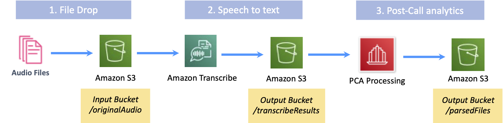

#### Ingesting files via File Drop into an Amazon S3 bucket

In a typical flow, a customer would configure their telephony system to export an audio file of a call once it has completed, which needs to be delivered to an Amazon S3 bucket. Some telephony systems are able to do this natively, but others may require some additional involvement from IT to setup a mechamism to upload the audio files from an on-premise location into the S3 bucket.

The high-level process flow is shown in the following figure.

##### 1\. File drop

The first part of the main ingestion flow is shown below and consists of the following steps:

1.  Audio file is extracted from the customer's telephony system
2.  Audio must be delivered into a specific Amazon S3 bucket and folder, which has been configured via the `InputBucketName` and `InputBucketRawAudio` configuration settings
3.  An event is triggered that begins the Post Call Analytics workflow that is orchestrated by AWS Step Functions, which is responsible for the rest of the process

Once a file arrives in the correct folder in the S3 bucket then the process is automatically started, and there is nothing that the user has to do - it is responsible for orchestrating the various calls to AWS services, handling error conditions, and generating all of the output data.

##### 2\. Speech to text 
The second part of the ingestion flow is around generating the base transcript of the call using Amazon Transcribe. This part is responsible for ensuring that all of the correct parameters are ready for the transcription job, and that the correct APIs are used for the operational mode that has been requested via the `TranscribeApiMode` configuration parameter.

1.  Determine if the configuration has Language Identifcation rather than a preset language - if so then a 30-second clip of the audio is created and sent through Amazon Transcribe so that the language can be identified
2.  Ensure that the configured settings for `TranscribeApiMode` and `SpeakerSeparationType` are valid given the format of the audio file; e.g. if the file is a mono single-channel file and the configuration requests the Analytics API then this will be downgraded to the Standard API for this file, as Transcribe Call Analytics only supports multi-channel audio
3.  Select the language-specific configuration settings for this audio file, such as the required custom vocabulary or vocabulary filter file, and sent the whole audio file through the relevant API for Amazon Transcribe
4.  The output from the Amazon Transcribe job will be delivered into a specific Amazon S3 bucket and folder. which are configured via the `OutputBucketName` and `OutputBucketTranscribeResults` configuration settings

Language identification with Amazon Transcribe Custom Vocabulary

Until the very end of the initial development of this solution it was not possible to supply a series of Custom Vocabulary defintions to Amazon Transcribe if it was also being asked to perform language identification. This new feature of Amazon Transcribe will be adopted in due course, which will both simplify the overall workflow and reduce the time and cost to process each call audio file.

##### 3\. Post-call analytics 

The final part of the ingestion flow will take the output from the Amazon Transcribe job and transform it into a file that creates a turn-by-turn conversation transcript that is augmented with any additional AI-derived metadata, all of which is then easily reportable on in your preferred business intelligence tool.

1.  A new MP3 file is created for playback if either of these conditions are true:
    -   audio redaction has been enabled, so use the redacted audio file created by Amazon Transcribe
    -   the original audio format is known to not playback in the current HTML 5.0 audio controls
2.  Output file header information is generated, such as Agent name, Call GUID and general call characteristics
3.  A turn-by-turn transcript is created, which will interleave overlapping speech as best it can
4.  Additional metadata from either Amazon Transcribe Call Analytics or Amazon Comprehend is inserted into the output file, either at the header level or inside the transcript lines (or both). This includes sentiment, detected categories, talk time, etc.
5.  The output from the analytics will be delivered into a specific Amazon S3 bucket and folder. which are configured via the `OutputBucketName` and `OutputBucketParsedResults` configuration settings

This output data is then used by the User Interface to render the call information, and allow some level of searching, and is then made queryable via Amazon Athena by any SQL-capable reporting tool.