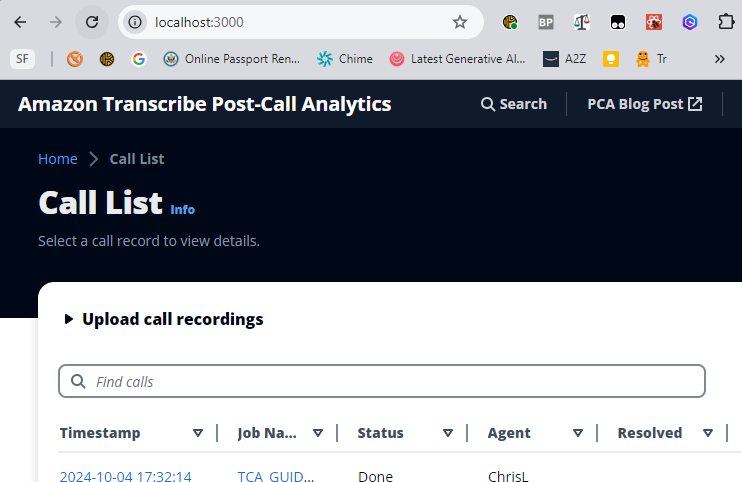

# Run PCA UI locally

## Prerequisites

1. If you haven't already, deploy PCA into your AWS account - see top level [README](../../../README.md).
2. Make sure you have Node.js v18 installed

### Setup

In directory `pca-ui/src/www`

1. **Install NPM packages locally**

- Run `npm install` to downloads and installs npm packages needed to run locally.

2. **Download cofig.js**

- open the PCA stack **Resources** tab, and navigate to nested `PCAUI` stack
- again open the **Resources tab**, and navigate to the nested `Web` stack
- again open the **Resources** tab, and navigate to the S2 bucket named `WebBucket`
- download and copy `config.js` file into the local `pca-ui/src/www/public` folder.

3. **Configure Cognito for local URL redirect\***

- open the PCA stack **Resources** tab, and navigate to nested `PCAUI` stack
- again open the **Resources** tab, and navigate to the nested `Cognito` stack
- again open the **Resources** tab, and navigate to the Cognito UserPool named `PCAUserPool`
- Open the **App integration** tab, and scroll down to **App clients and analytics**
- Open the App client `PCAUserPoolClient-XXXX`
- Under **Hosted UI** click **Edit**
- Under **Allowed callback URLs** click **Add another URL**
- Enter `http://localhost:3000/` to enable login redirect to your local PCA UI server
- Click \*_Save Changes_ at the bottom of the page

### Run PCA UI Server locally

- Run `npm run start`
- Navigate to http://localhost:3000 in a browser -- the existing PCA should load up on the local browser, in development mode.

The page will reload if you make edits.\
You will also see any lint errors in the console.

