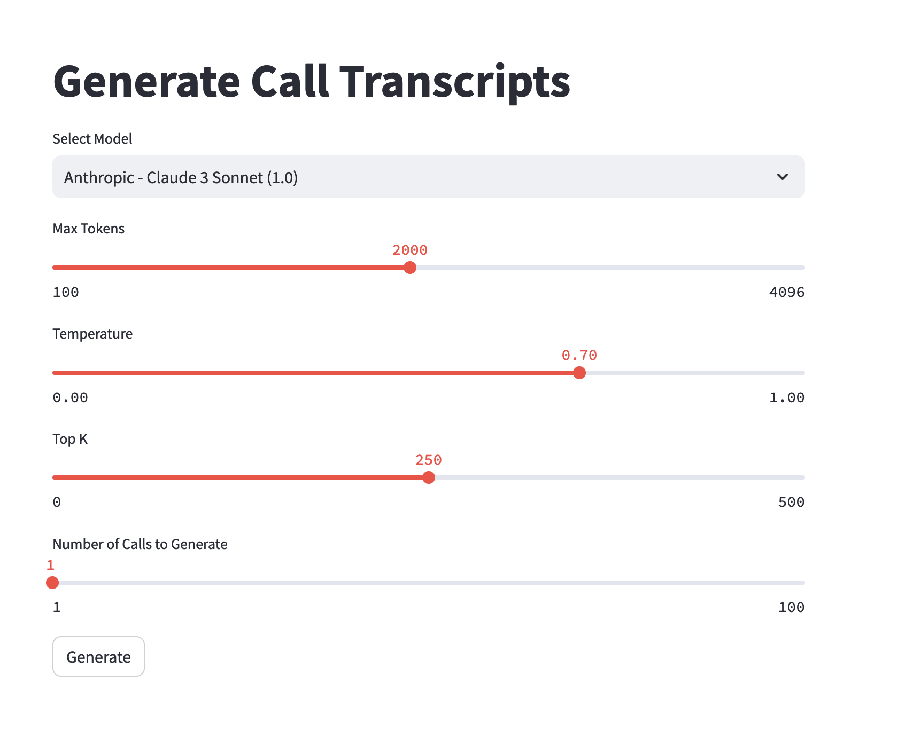

# pca-synthetic-data

## About
### Description
This project is designed to create synthetic data (mp3 recordings) for PCA solution 
https://aws.amazon.com/blogs/machine-learning/post-call-analytics-for-your-contact-center-with-amazon-language-ai-services/


## Getting started

### Installation

Create a virtual environment and install the required packages there. Here's how you can do it:

1. Install `virtualenv` if you haven't already:

   ```
   pip install virtualenv
   ```

2. Create a new virtual environment:

   ```
   virtualenv env
   ```

3. Activate the virtual environment:

   ```
   source env/bin/activate
   ```

4. Install the required packages:

   ```
   pip install -r requirements.txt
   ```

### Usage

Define the number of recordings in Python code
   ```
   number_of_recordings = 1
   ```


Now you're ready to run the Python code.

   ```
   streamlit run calls-creation-polly.py
   ```



## Authors and acknowledgment
This project was created and is maintained by @chadaws and @orvital 

## Contributing
We welcome contributions from the community! If you'd like to contribute to this project, please follow these guidelines:

1. Fork the repository and create a new branch for your feature or bug fix.
2. Make your changes and ensure that the project still builds and tests pass.
3. Submit a merge request with a clear description of your changes and the problem they solve.

We'll review your contribution and provide feedback or merge it into the main branch if it meets our standards.

## Support
Tell people where they can go to for help. It can be any combination of an issue tracker, a chat room, an email address, etc.

## Roadmap
TBD


## License
For open source projects, say how it is licensed.

## Project status
If you have run out of energy or time for your project, put a note at the top of the README saying that development has slowed down or stopped completely. Someone may choose to fork your project or volunteer to step in as a maintainer or owner, allowing your project to keep going. You can also make an explicit request for maintainers.
